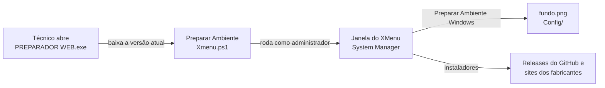

# XMenu System Manager — Preparador de Ambiente

Ferramenta em **PowerShell + Windows Forms** que prepara e dá suporte aos computadores que rodam **XMenu** e **NetPDV**. O técnico abre um único executável e tem, numa janela só, o preparo do Windows, os instaladores, os diagnósticos e os reparos que antes eram feitos à mão, um por um.

O executável não carrega o programa dentro dele: a cada abertura ele baixa a versão mais recente do script direto deste repositório. Uma correção publicada aqui chega a todos os técnicos na próxima vez que eles abrirem o programa, sem precisar reenviar arquivo.

Desenvolvido por **Vinicius Mazaroski**.

---

## Download

| Edição | Executável |
|---|---|
| XMenu | [PREPARADOR WEB.exe](https://github.com/VMazza10/Preparador-de-Ambiente-XMenu/raw/main/Executaveis/PREPARADOR%20WEB.exe) |
| Revenda | [PREPARADOR WEB REVENDA.exe](https://github.com/VMazza10/Preparador-de-Ambiente-XMenu/raw/main/Executaveis/PREPARADOR%20WEB%20REVENDA.exe) |

**Requisitos:** Windows 10 ou 11, internet e abrir como administrador (botão direito > *Executar como administrador*).

---

## Funcionalidades

### Preparar Ambiente Windows (um clique)
Ajusta energia, UAC e desempenho, limpa temporários, aplica o papel de parede padrão, cria o atalho de suporte na área de trabalho, protege as portas USB contra a impressora que desconecta sozinha e acerta o relógio pelo `pool.ntp.br` (exigência da NFC-e).

Antes isso era um passo a passo manual ([tutorial antigo](Recursos/Tutorial%20de%20Instala%C3%A7%C3%A3o.png)); hoje é um botão.

### Instaladores
- **Banco de dados:** SQL Server 2008 e 2019, SQL 2019 + SSMS
- **Programas Netcontroll:** NetPDV, Concentrador, Link XMenu, XBot, XTag Client, Cardápio Tablet e Totem de Autoatendimento
- **Fiscal e periféricos:** TecnoSpeed NFC-e, VSPE + Epson Virtual Port, driver de balança serial
- **Externos:** TeamViewer, AnyDesk, Google Chrome, Revo Uninstaller, TEF HUB, Advanced IP Scanner e Balança Teste

### Suporte e diagnóstico
- **Impressoras:** compartilhamento, drivers por marca/modelo e impressoras LPR — cria a impressora, imprime teste e corrige a porta sozinha quando o IP do PC da impressora muda (acha o PC pelo MAC e pelo nome na rede)
- **Baixar XMLs NFC-e:** por série, período, chave ou pedido, com espelho fiscal da nota em PDF
- **Backup do banco NetWebPDV:** backup completo com o banco no ar, sem parar o serviço
- **Diagnóstico:** avaliação de hardware, scanner de impressoras na rede, ping contínuo com log, monitor de CPU e RAM, serviços do SQL Server e diagnóstico de rede
- **Reparos:** SFC, DISM, limpeza de disco profunda, Windows Update, spooler de impressão, impressora USB (MP-4200 e outras), reset de rede e DNS, sincronização do relógio

---

## Edições

| | XMenu | Revenda |
|---|---|---|
| Script | `Preparar Ambiente Xmenu.ps1` | `Preparar Ambiente Revenda.ps1` |
| Papel de parede | `fundo.png` | `fundo_revenda.png` |
| Atalho "Suporte Xmenu" e pasta `C:\Netcontroll` | sim | não |

---

## Como funciona



Os arquivos do próprio programa vêm por endereço fixo de `raw.githubusercontent.com/VMazza10/Preparador-de-Ambiente-XMenu/main/`. Os instaladores grandes ficam nas *Releases* do repositório.

---

## Estrutura

```
├── Preparar Ambiente Xmenu.ps1     programa, edição XMenu
├── Preparar Ambiente Revenda.ps1   programa, edição Revenda
├── fundo.png                       papel de parede XMenu
├── fundo_revenda.png               papel de parede Revenda
├── Config/                         página e ícones do atalho "Suporte Xmenu"
├── Executaveis/                    o que é enviado aos técnicos
│   ├── PREPARADOR WEB.exe
│   ├── PREPARADOR WEB REVENDA.exe
│   ├── PREPARADOR WEB.BAT          mesma função do exe, em .BAT
│   ├── PREPARADOR WEB REVENDA.BAT
│   └── Antigos/                    versões anteriores dos executáveis
├── Ferramentas/
│   ├── TESTAR ANTES DE SUBIR.BAT   abre o XMenu ou o Revenda local (para testar antes de publicar)
│   ├── CLIQUE AQUI.BAT             abre o XMenu local
│   └── GIT_PUSH.bat                publica as alterações no GitHub
├── Recursos/                       wallpapers, tutorial antigo e atalho de exemplo
└── BKP/                            cópia de segurança dos scripts
```

### ⚠️ Arquivos que não podem mudar de nome nem de lugar

O programa e os executáveis já distribuídos baixam estes arquivos por endereço fixo. Mover ou renomear quebra o programa em todos os computadores:

| Arquivo | Quem baixa |
|---|---|
| `Preparar Ambiente Xmenu.ps1` | `PREPARADOR WEB.exe`, `PREPARADOR WEB.BAT` e `Antigos/PREPARADOR WEB 3.0.exe` |
| `Preparar Ambiente Revenda.ps1` | `PREPARADOR WEB REVENDA.exe`, `PREPARADOR WEB REVENDA.BAT` e `Antigos/PREPARADOR_REVENDA.exe` |
| `fundo.png` / `fundo_revenda.png` | botão Preparar Ambiente Windows |
| `Config/` (todos os arquivos) | botão Preparar Ambiente Windows (atalho de suporte) |
| `Executaveis/PREPARADOR WEB.exe` e `PREPARADOR WEB REVENDA.exe` | links de download enviados aos técnicos |

---

## Desenvolvimento

1. Edite o script e teste com `Ferramentas/TESTAR ANTES DE SUBIR.BAT`, que abre a cópia local do XMenu ou do Revenda.
2. Publique com `Ferramentas/GIT_PUSH.bat` (ou `git push`).

> O que vai para a branch `main` entra em produção na hora: é de lá que os executáveis baixam o script.

**Tecnologias:** PowerShell 5.1, Windows Forms, .NET (sockets TCP/UDP, WebClient), WMI/CIM, cmdlets de impressão e rede do Windows, GitHub como servidor de distribuição.
